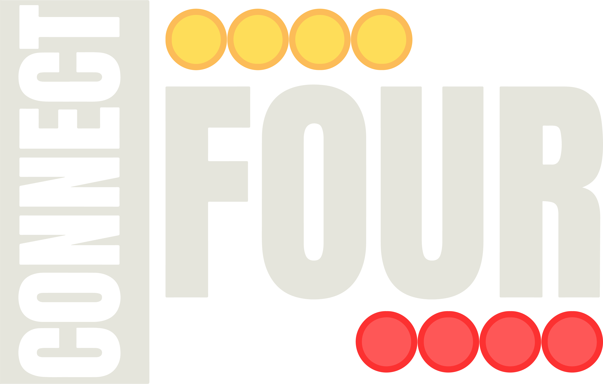
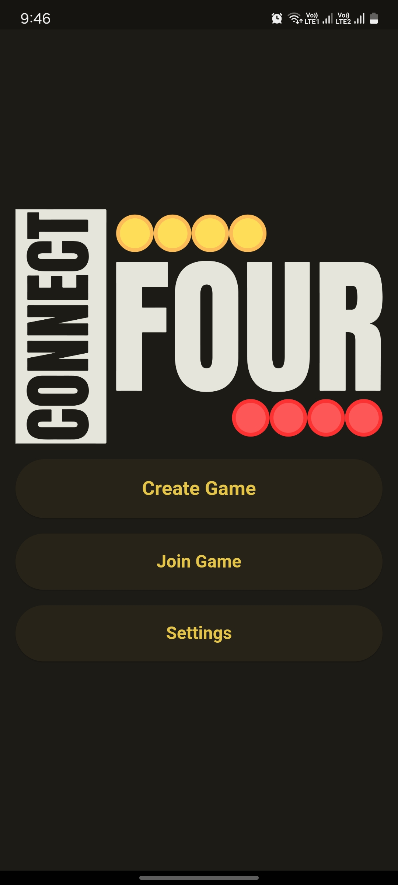
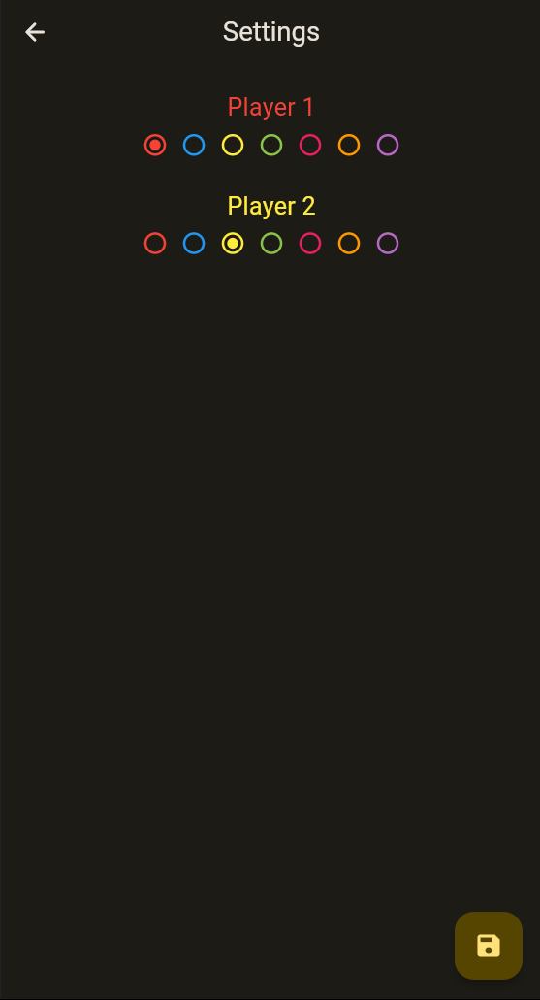
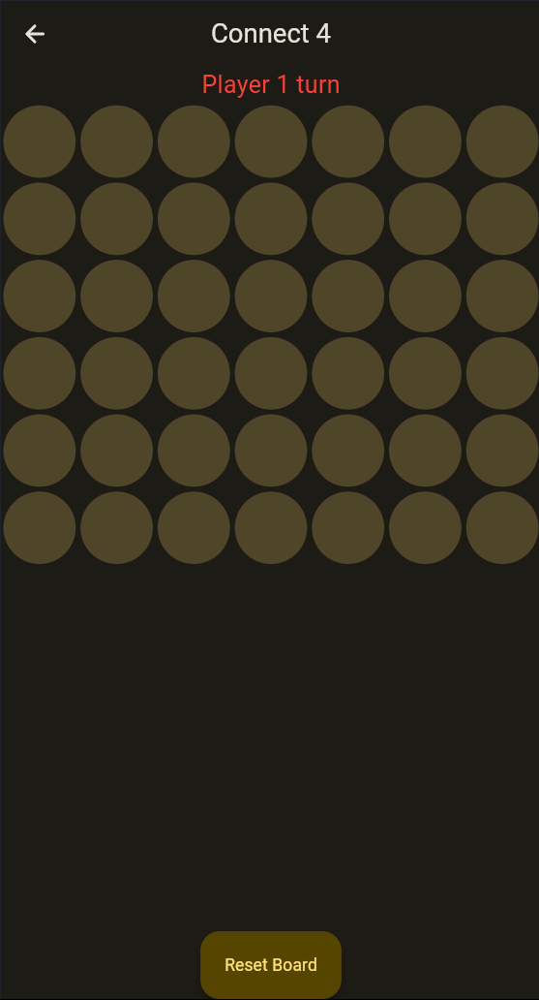
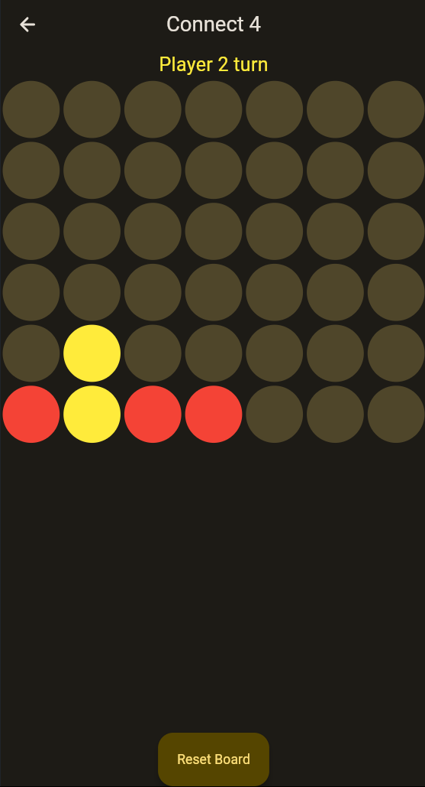

# Connect 4 Game  

**Connect 4** is a modern take on the classic game, built using **Flutter** and powered by **Firebase**. This project offers seamless **multiplayer gameplay** with exciting customization options and robust **multiplatform support**. Players across different versions of the app can also enjoy smooth gameplay with **interoperability**.  

---

## Features  

### 🎮 Multiplayer Gameplay  
- Play with friends or compete with others online in real-time.  
- Smooth and responsive gameplay experience.  

### 🎨 Custom User Colors  
- Personalize your gaming experience by choosing unique colors for your tokens.  

### 🌐 Multiplatform Support  
- Available on mobile (Android, iOS), web, and desktop platforms.  
- Play seamlessly across devices with consistent performance.  

### 🔄 Version Interoperability  
- Ensures compatibility between different versions of the app, so players can enjoy the game together without version restrictions.  

---

## Tech Stack  

- **Flutter**: For a flexible, high-performance, cross-platform UI/UX.  
- **Firebase**: Handles real-time data synchronization and backend services.  

---

## How to Play  

1. Install the app on your preferred device.  
2. Open the app and start a game—no login or sign-up required.  
3. Join or create a multiplayer game.  
4. Drop tokens into the grid and connect four in a row to win!  
5. Customize your token colors for a personalized experience.  

---

